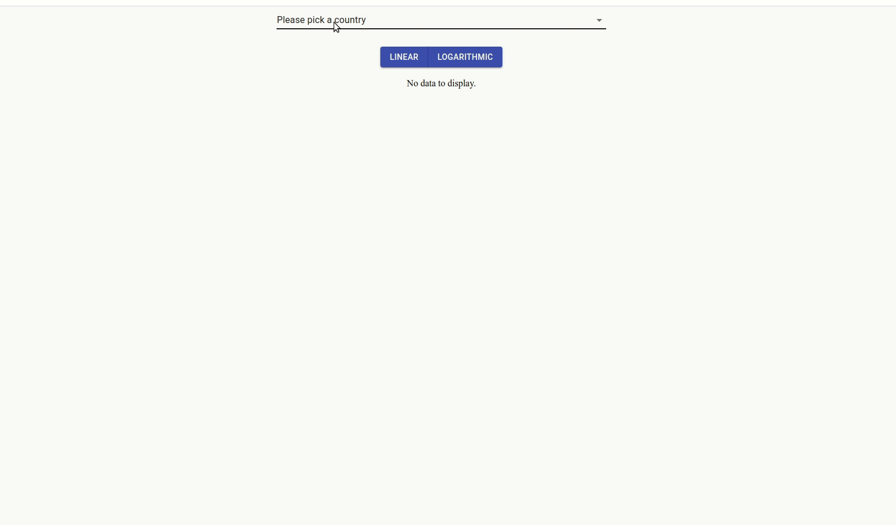

# covid-19-databoard with React

## Demo

## Data Source

- [Johns Hopkins CSSE API](https://covid19api.com/)

## Modified from 

- [This repo](https://github.com/adrianhajdin/project_corona_tracker)
### Modifications:

- Create new handlers to consume a different API that provides daily data for all case status (confirmed, recovered & dead) as oppose to only for confirmed and dead cases. 

- Use line chart exclusively instead of switch to a bar chart of current total cases. The bar char visualizes the info displayed in the cards making it redundant.  

- Allow user to switch between liner and logarithmic scale, add customized y-ticks as neccessary.  

- Remove unused hooks & lift the state up in the component hierarchy, all components uses their parent state. 

- Add a corner ribbon to direct user to the data source (not shown in demo gif). 

## To run locally

1. Clone this branch to your local machine: `git clone -b react-db git@github.com:hyperL1ght/covid-19-databoard.git`
2. Change to the local repo, run `npm install` to install all required packages
3. Run `npm start`, the app should automatically open in your default browser

## Todo

- Implement the since-100th-case line plot, static demo using `matplotlib` shown below:

    
